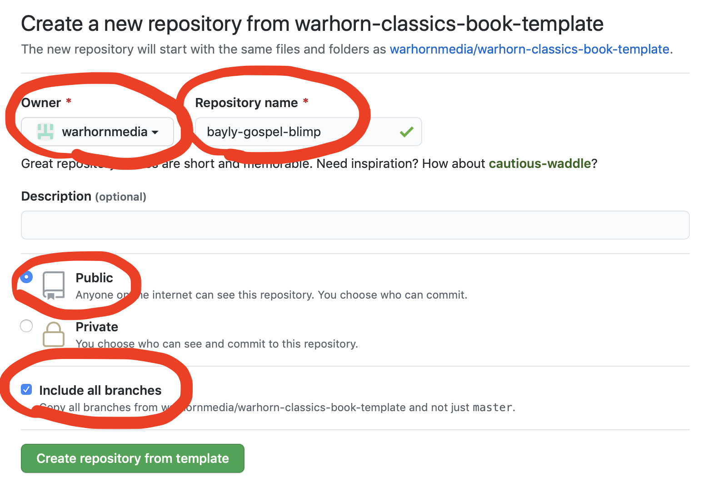

# Creating a new book from scratch

## Creating a new repo for a new book on Github

NOTE: This guide assumes you already have the ability to work with Git repositories on Github, including checking out repos, as well as making and pushing commits. (Also, if you are not a power user of Git, we recommend [Github's desktop tool](https://desktop.github.com). It makes it simple to work with repos without memorizing command-line syntax, and it handles most simple scenarios.)

1. Go to [our empty book repo](https://github.com/warhornmedia/classics-empty-book) on Github and click "Use this template." (You must be logged into Github already.)

```{r echo = FALSE, fig.align = 'center', out.width = "65%"}
knitr::include_graphics('images/screenshot1.png')
```

2. Change the owner to warhornmedia. Enter a repository name using the format "authorlastname-short-book-title". Set the repository to public. And include all branches. Then click "Create repository from template"

```{r echo = FALSE, fig.align = 'center', out.width = "65%"}

```

3. Clone the new repo to your computer and begin making changes

*Congrats!* You now have a new book that will rebuild automatically any time you push changes to github.

Your next task will be to update all of these files, and then to add the book content. You will find this information in the following sections.

### (Optional) Preparing and using a local build environment

Being able to build a book locally can save time so you don't have to wait for the book to be rebuilt by continuous integration. Typically a local build is done in under 10 seconds, and an online build takes 2-3 minutes. This can really add up if there is a problem you are trying to fix through trial and error. 

**Instructions:**

1. Download RStudio for desktop [here](https://rstudio.com/products/rstudio/).
2. Make sure that [LiberationSerif](https://www.fontsquirrel.com/fonts/liberation-serif) is installed. (TODO: When we finalize fonts, this will need to be updated. It's possible it's already out of date.)

Now you can open the file that ends in .Rproj, and you should be able to click "Build Book" in the "Build" tab in the upper right.

**A note on classics-template-files:** When you first build the book locally, a new folder will be created in the book folder called classics-template-files. These files come from a separate repository by the same name. They allow us to make changes to the style and front matter of every book from one central location. But once you have these files in your local book folder, they will not be updated with new changes to the design unless you delete the whole classics-template-files folder. (This folder is  excluded from tracking git, so you don't need to worry about deleting it or updating it before committing changes to the book.) Thus, if you have not worked on a book for a while, it makes sense to delete this folder from your local book repo before you next work on it.

## What are all these files?

Below is a list of the files in the book template, along with a description of that file and the contents. If the name of a field inside a file is **bold** below, that means you need to customize that field for a new book.

### Files you must modify

01-Basic-instructions.Rmd
: Contains the content of the first chapter of the template book. **Should be deleted or renamed** and its content replaced with the first chapter of the new book. See 

_bookdown.yml
: contains some settings for bookdown. 
: 
: Contents:
: 
:  - **book_filename:** Change this to give book downloads, such as PDFs, appropriate filenames. Don't use spaces. Standard: author’s last name followed by short title, like so: \
    `book_filename: "Ryle-Duties_of_Parents"`
:  
: Don’t change anything else in this file, unless you need “chapters” to be called something else. If so, make sure you check all the output formats thoroughly and report back. This is currently untested in our books.

_editorial-notes.Rmd
: Contains two sections that must be updated throughout the editorial process, and is automatically included in the front matter of the book.
: 
: Contents: 
:
: - **Text Status** This section should be updated by moving the "**Current status:** -->" to the front of the appropriate line as the project progresses.
:
: - **Editorial Notes** Any noteworthy editorial decisions should be added to this section.

cover.jpg
: **Should be replaced** with an image of the book cover. Alex is working on a simple design that will be able to be used for all of the books. Both JPG and PNG files are supported. 

index.Rmd
: Contains many settings for the book and the code to automatically include the Classics front matter in each book. Anything not mentioned below should be left unchanged.
: 
: Contents:
: 
:  - **title, author, and date** must all be changed and should be self-explanatory
:  - **description:** Short description of the book. Don't use copyrighted content here. Write your own description. This field is useful for SEO. Also, it is displayed together with the cover image when the book is shared on certain social media.
:  - **params:**
:    - **pubinfo:** This appears in the front matter and should be updated with the original publication info. 
:    - **scans:** Enter a link to scanned images of the original public domain work on Archive.org, Google books, or elsewhere.
:    - build: This can be any number. Change the build number if you ever want to force the book to rebuild but haven’t changed anything else. It’s used for no other purpose.
:  - **cover-image:** the name of the image file being used as the cover for the book. Make sure to include the extension, such as cover.jpg, or cover.png.
:  - **url:** the page where the book is hosted. Should be https://warhornmedia.github.io/your-new-github-project-name/ Replace the last part with your project name. [Currently](https://github.com/rstudio/bookdown/issues/963) that ending “/“ is necessary. 
:  - **output:**
      - **bookdown::gitbook:**
        - **config:**
          - **toc:**
            :  **before:** This content is shown above the TOC on the web version of the book. Having the book title (and author last name if it will fit), is helpful for people to know what they are looking at. Change this on the second line.
          - **edit:** where the edit link on each page points to. Should be the GitHub project URL, followed by “/edit/master/%s”

README.md
: The description of the repo that will be displayed on the Github project page. **Update this** with some simple info and a link to the readable book. 

### Other files

_output.yml
: Contains a number of settings for the various output formats. You generally shouldn’t need to make changes to this file. However, you can modify the following line to remove links to any format if necessary. For example, if the PDF won't build or has problems, simply remove it from the list.
: 
: -     download: ["pdf", "epub", "mobi"]

book_project.Rproj 
: This file can be ignored. If you use the Rstudio IDE, this is your project file, and you’ll probably want to rename it to the book title just so you don’t get confused which book project you are working on.

.github folder
: contains the Github Actions workflow file that rebuilds the book automatically every time a new commit is pushed to Github. You shouldn't need to mess with this folder. In fact, it is a hidden file, so you normally won't see it at all unless you are working on the command line or Github.

.gitignore
: Specifies which files are not to be tracked in git. In particular, we only want to track book source, not output files (_book), files related to RStudio, or external files used in the build process (classics-template-files). This file already has the right settings. You shouldn't need to mess with this file. In fact, it is a hidden file, so you normally won't see it at all unless you are working on the command line or Github.


## Adding book content

To add content to the book, simply add .Rmd files. .Rmd files are just text files written in R-markdown. R-markdown is just normal markdown with some extra features supported. The details of the features we support are outlined below. (TODO: We should probably add to this documentation the basic rules about how we want our markdown formatted.)

Note: The filename must end with .Rmd, not .md, if you want it included in the book. That is why the README.md file is not build into the book. 

All the markdown files found in the main directory will be combined into a book, ordered by filename. So use numbers at the beginning of the files to indicate the order they should go in. Note that index.rmd will always come first, though, and will automatically include the Warhorn Classics front matter. 

To *exclude* a file from the book, simply preface the filename with an underscore. For example, "_excludedfile.Rmd" will not be added to the book by default, even if it is in the main directory with all the other Rmd files.

Here is an example list of files in the order they will end up in the book. 

```
index.Rmd
00-preface.Rmd
01-The-Sacraments-In-General.Rmd
02-The-Sacrament-of-Baptism.Rmd
03-The-Sacrament-of-the-Lords-Supper.Rmd
```

Note that the numbers at the beginning of each filename are *only* used to get the files into the proper order in the book. It is handy if they can correspond to the chapter number just to prevent confusion, but it is not necessary.

The online version of the book will be split up into separate pages, not just one long web page. The split will happen at each new .rmd file.[^1] Thus, in most cases a new .rmd file should be created for each chapter. 

**NOTE:** Each .rmd file must begin with the title of the chapter (or section) it contains. (The proper syntax is described in the next section.)[^2] 

[^1]: This [can be changed](https://bookdown.org/yihui/bookdown/html.html#gitbook-style), if necessary, to split by chapter or section, or even turned off completely.

[^2]: Supposedly the first file must begin with either a chapter ("# Chapter name") *or* a section ("## Section title"). However, it appears that it must be a chapter, as starting with a section causes an error. Latter files may start with a section, instead, if necessary, to split the book into appropriate-length webpages.


## Chapters, sections, and more

The primary structure in Warhorn Classics books is determined by various levels of headers, and it can easily be seen in the automatically generated table of contents.

By default, the top level of structure is called a "chapter." However, this word can be changed in _bookdown.yml if necessary for sermons or other types of works where "chapter" is not appropriate.[^3]

[^3]: The bookdown documentation says it is [also possible](https://bookdown.org/yihui/bookdown/markdown-extensions-by-bookdown.html#special-headers) to split a book into "parts" made up of multiple chapters, as well as add a special "part" called "appendix." However, ebooks and Word documents do not get any "part" information, so we do not support this option in our books. 

The start of a chapter is specified in the text with a # followed by the title of the chapter. Here is an example of the proper syntax:

```markdown
# A Long-expected chapter title
```

The chapter title will be given an \<h1\> tag in HTML, with similar results in other formats.

Chapters can be broken down further into sections, sub-sections, etc. up to 6 levels total, using additional levels of headers and titles:

```markdown
## This is a section. (It will receive an <h2> tag in HTML.)

### Here is a sub-section.

#### And now a sub-sub-section

###### This is the deepest level supported, because <h6> is the deepest header level supported in HTML.
```

### Numbering (or not)

Chapters, sections and subsections will all be automatically numbered, unless you exclude them from numbering by adding "\{-\}" to the end of the line. For example, generally an introduction should not be numbered:

```markdown
# Introduction {-}

Text of the introduction goes here...
```

Or perhaps the subsections in the book are not numbered:

```markdown
# How to write a book

## Getting started

### Arranging your pencils {-}
```

It is possible to assign an ID *and* specify that a section is not to be numbered like so:

```markdown
## Section forty-five {- #sec-45}
```

### IDs

Chapters and sections always have an ID so they can be linked to. If one is not set explicitly, one will automatically be given (implicitly) based on the title. This will be discussed later in the references section. 


# Formatting

## Overview

Formatting should not be used for structural elements such as headers or captions. Our templates will style those elements according to a standard design. Formatting should only be done where the formatting is essential to the text. For example, bold or italics that the author is using for emphasis should be included, whereas if a (sub)section heading is italicized in the source book, that is a question of design.

Formatting is accomplished by using R-markdown. Basically, you can use anything that [Pandoc supports](https://pandoc.org/MANUAL.html#pandocs-markdown). Where Pandoc supports multiple options, we have generally chosen a specific method. If you need to use something not mentioned below, please suggest it be added here.

## Italics

*Italicized text* is indicated by surrounding it with single asterisks.

```markdown
Here are *a couple* in italics.
```

## Bold

**Bold text** is indicated by surrounding it with double asterisks.

```markdown
Here are **a few words** in bold.
```

## Small caps 

I cannot think of any other circumstance where smallcaps should be used except the word [Lord]{.smallcaps}.

```markdown
[Lord]{.smallcaps}
```

## Centering text

I cannot think of a place where text would need to be centered in the text of a book.

```markdown
::: {.center}
Republished by Warhorn Classics
:::
```

# Special characters

There are a number of special characters that are created using a backslash (\\) before another character. These two-character codes are easily visible in the markdown because of the the backslash, where otherwise they would be difficult to notice.

## Non-breaking spaces

Non-breaking spaces prevent two words from being split onto separate lines. There are a variety of cases in which they are necessary, including Scripture references. They are formed by putting a backslash prior to a regular space.

```markdown
1\ Peter\ 1:3 
```

## Line breaks

Sometimes, you may need to specify that text should start on a new line but remain part of the same paragraph. This can be accomplished by putting a single backslash at the end of a line. 

```markdown
This paragraph will continue \
on the next line.
```

## Backslashes

Because backslashes are are special characters, if one needs to appear for some reason in the actual text of a book, it must be 'escaped' using another backslash. In other words, put two backslashes like so in the markdown followed by the output:

Markdown:
```markdown
Here is a backslash \\ in the middle of a sentence. 
```

Output:
Here is a backslash \\ in the middle of a sentence. 


# Comments

If you ever need to leave a comment in the source but you don't want it to appear in the built books, you can use the following format. It is the standard HTML comment, but with an extra dash to open it. These comments will not even show up in the HTML source. If you use a regular HTML comment with just two dashes, they will show up in the HTML source.

```markdown
<!---
your comment goes here
and here
-->
```

# Poetry

Poetry should be designated as such so it can be styled differently from the rest of the text:

```markdown
::: {.poetry}
- Oh when a mother meets on high
- The babe she lost in infancy,
- Hath she not then for pains and fears,
- \ \ \ \ The day of woe, the watchful night,
- For all her sorrows, all her tears,
- \ \ \ \ An over-payment of delight?
:::
```

Precede each line of poetry with a hyphen and a space. (This makes poems into lists, technically. Perhaps this is not the best way of styling them. If we do something else, then line breaks will need to be added manually with a backslash (\\) at the end of each line, or the lines need to be double-spaced in order to make each line its own paragraph. For now, this method is working, except in the PDF the lines start with bullet points.) If a line of poetry should appear indented further than the other lines in its final form, precede the text of the indented line with non-breaking spaces (after the hyphen and space at the start of the line), which are entered as spaces preceded by backslashes.


# Links

## Assigning implicit or explicit ID names {#assigning-ids}

Chapters, sections, and sub-sections are automatically assigned ids using their full (lowercase) text with spaces replaced by dashes and punctuation dropped. For example, this section would be automatically assigned an id of "automatic-and-manually-assigned-ids". This is an implicit id. 

Because automatic ids change with the text, and because they can get long, it is generally better to assign explicit ids manually to chapters, sections, and sub-sections if you need to link to them. 

Images and links are not given implicit ids, but can be assigned explicit ids if necessary. Here is an example of assigning an explicit id for a chapter:

```markdown
# My very long chapter title that I don't want to have to type often {#long-chapter}
```

To assign an id to an arbitrary location in the text (for the purposes of linking to a particular paragraph deep within a section, for example), you need something that can be assigned an id. If there is no image or heading to receive an ID, a workaround is to create an empty link and assign it an explicit id. 

At the end of this sentence is a link without any text or destination that creates a named ID. [](){#namedEmptyLink} You will not see it, but it will exist in the HTML, allowing us to link to it from the [references section](#references) below. (TODO: Test this feature is in ePub and PDF.) The markdown to create it looks like this:

```markdown
A sentence ending with a named empty link. [](){#namedEmptyLink}
```


## External links

Links are easily added using standard markdown like so:

```markdown
This text needs a link [here](http://google.com).
```

External links can also be named (given an ID) as detailed [above](#assigning-ids). For example:

```markdown
This text needs a named link [here](http://google.com){#my-named-link-id}.
```

Linking to any sort of content within the book itself is called a reference and is addressed next.


## References (ie internal links) {#references}

If the author refers to another chapter or section of his book, we can add a link to it without needing an actual url. All that is necessary is that we know the assigned ID of what we want to reference (see above sections on [sections](#chapters-sections-and-more) and on [assigning ids](#assigning-ids)). Simply bracket the words you want to link, followed by a set of parentheses with a pound sign and the id you want to link to. Here are a couple of examples.

```markdown
Here is how I would add a link to the section later in this guide which is about [non-english content](#foreign-languages) since its (implicit) id is "foreign-languages".
```

**Output:**
Here is how I would add a link to the section later in this guide which is about [non-english content](#foreign-languages) since its (implicit) id is "foreign-languages".

In the section about assigning ids, we mentioned that it is possible to insert an anchor for linking to any arbitrary spot by creating an empty, named link. [Here](#namedEmptyLink) is a link back to that named empty link above. The markdown looks like this:

```markdown
[Here](#namedEmptyLink) is a link back to the arbitrary location with a custom name. 
```

## Footnotes

Footnotes are a special kind of link that can be added to any content in a book, including section headings or chapter titles (but see warning concerning multi-paragraph footnotes below). 

Please put footnotes in the markdown source text directly under the paragraph where the footnote occurs. This will make it much easier to find and edit the footnote in the source document. [Because of (potential) bugs](https://community.rstudio.com/t/how-can-i-enable-the-file-scope-option/83741), every footnote in the book *must* have a unique name.[^fnnaming]

[^fnnaming]: Technically footnotes aren't numbered in our source. They are *named*. They are then assigned consecutive numbers per chapter automatically when the book is built. We use numbers for the names in order to simplify the process of editing as well as to guarantee unique names.

The naming should follow this pattern: chapter number, period, footnote number. So the first footnote in the first chapter would be named "01.01". The third footnote in the fifth chapter would be "05.03". A footnote in the intro could be named "intro.01".

**Simple footnote syntax:**

```markdown
Footnotes are often found at the end of a sentence like so.[^01.01]

[^01.01]: Here is the footnote's content, in its own paragraph with a blank line above and below.

Now the main text of the book continues.
```

If the structure of a particular book demands a more detailed naming of footnotes, it may be appropriate to lengthen footnote names for clarity's sake. For example, a book with lengthy sections within chapters might have footnotes named as follows: "01.01.01", "01.01.02", etc., throughout chapter 1, section 1; then "01.02.01", "01.02.02", etc., throughout chapter 1, section 2. The most important thing is that each footnote have a unique name.

**Multi-paragraph footnote:**

Indent latter paragraph(s) in a footnote by four spaces to indicate that the footnote is continuing.[^4]

[^4]: Here is my multiparagraph footnote, just to prove that it works.

    See? Second paragraph works just fine. :)

```markdown
Longer footnotes can also appear in books.[^01.02]

[^01.02]: Another (longer) footnote. It is possible to have multiple paragraphs in a footnote.

    Simply put four spaces before the next paragraph(s) to indicate that the footnote is continuing.
  
Here is the next paragraph of the book. It is no longer part of the footnote.
```

**Warning**: Multi-paragraph footnotes *cannot* be referenced inside bold or italic text or from within chapter or section headers, because of [a bug](https://github.com/jgm/pandoc/issues/6733) in Pandoc. However, they do work within blockquotes. There may be other similar places yet to be found. Check for footnotes inside formatted text if rendering the PDF fails with an error something like this: `! Paragraph ended before \text@command was complete.` If you find another place where multi-paragraph footnotes don't work, please update this documentation.

## Endnotes

Endnotes can be created simply by creating a separate file[^5] for them, and giving them named IDs and then linking to them as references from the body of the main text. In this way, they are not special links, and they are compatible with footnotes. The end of this sentence has an endnote to demonstrate what an endnote normally looks like. ([1](#en.01))

**NOTE**: Endnotes do not automatically backlink to the place they are referenced from. 

**NOTE 2**: Since endnotes are simply internal links, they are not able to be styled differently (such as being in superscript) by default. If need be, there may be ways around this limitation.

[^5]: There is an endnote file in this style guide, for demonstrations' sake. And this is a demonstration of an endnote within a footnote. [2](#en.02)


### Creating an endnote

To make it so we can link to endnotes, we need to give each one an ID. The only book with endnotes so far is Buchanan's *justification*. Each endnote has a title in that book, such as "Note 2, p. 21", so we used the lowest level of header for the endnote title, and gave it an explicit ID like so:

```markdown
###### NOTE 2, p. 21  {- #en.p1.02}

endnote text goes here...
```

The endnote ID should be named as follows:

en.chapternumabbrev.endnotenumber

So the above endnote is the second endnote in opening of Part 1 before you get to chapter one. Here's how you'd name the ID for the third endnote in chapter 1:

#en.ch01.03

### Linking to an endnote

To link to the endnote from within the text, simply follow the instructions for references (internal links) [above](#references). Note that the linked text is not automatic in any way, and can be set to any text. For example, you could make the link "Footnote 1", though that might be too disruptive to the flow of the text, and it is not likely that the original book had that. Still, it is important to understand that the "2" in the example below is not meaningful to bookdown, except as the text to be linked. Here is an example of what it looks like to link to an endnote in the markdown:

```markdown
This sentence ends with a linked endnote in parentheses.([2](#en.p1.02))
```


# Foreign languages

Any text in a foreign language, regardless of how long or short, should be indicated as such with the appropriate two-letter language code, which can be [found here](https://www.w3schools.com/tags/ref_language_codes.asp). Here is the what the markup looks like for a couple of the most common languages you might need.

**Latin:**

```markdown
[sacramentum]{lang=la}
```

**Greek:**

```markdown
[μυστηριον]{lang=el}
```


# Typos in the original

Typos can and do appear in the original source documents at times. Our policy is to correct obvious typos, such as spelling errors, making a note of them in the text like so.

```markdown
<!-- Original typo: "profssing" -->
```

Stylistic changes, such as switching from British to American quotes are not considered typos and do not need to be noted. 

However, sometimes a word may be missing, or the wrong word inserted. If you believe you have found a typo, but correcting it changes the meaning of the text, please submit it to the editorial team for evaluation. If a change is made in such a circumstance, it will be noted visibly in the text, either through a footnote or an editorial bracket.


# Images

Images are likely to be rare, but when used, Pandoc's built-in functionality is not enough. Images are to be placed in a sub-folder called "images" and included using knitr commands:

**Centered and 50% width image:**

````markdown
`r ''````{r, echo=FALSE, fig.align='center', out.width='50%'}
knitr::include_graphics("images/sepialogo.png")
```
````

Here is what it looks like when used:

```{r, echo=FALSE, fig.align='center', out.width='50%'}
knitr::include_graphics("images/sepialogo.png")
```


# Troubleshooting

What to do if your build is failing:

1. Especially if you just added the OCR'd text of the book, do a search for backslashes in the text. They are a special character and will cause problems unless they are used for the specific things mentioned [above](#backslashes).
2. Make sure every .Rmd file starts with either # or ##.
3. If you are working on footnotes, make sure you didn't try to insert a footnote reference inside bold or italic text or from within chapter or section headers *if* the footnote itself has multiple paragraphs. (See warning in [footnote section](#footnotes).)
4. Take a look at the log in the Github Action tab, and see if you can find where it failed. (Look for a red line.) Sometimes it will tell you what went wrong, but often the best hint is a number of lines earlier, so scroll up a bit looking for a root cause.
